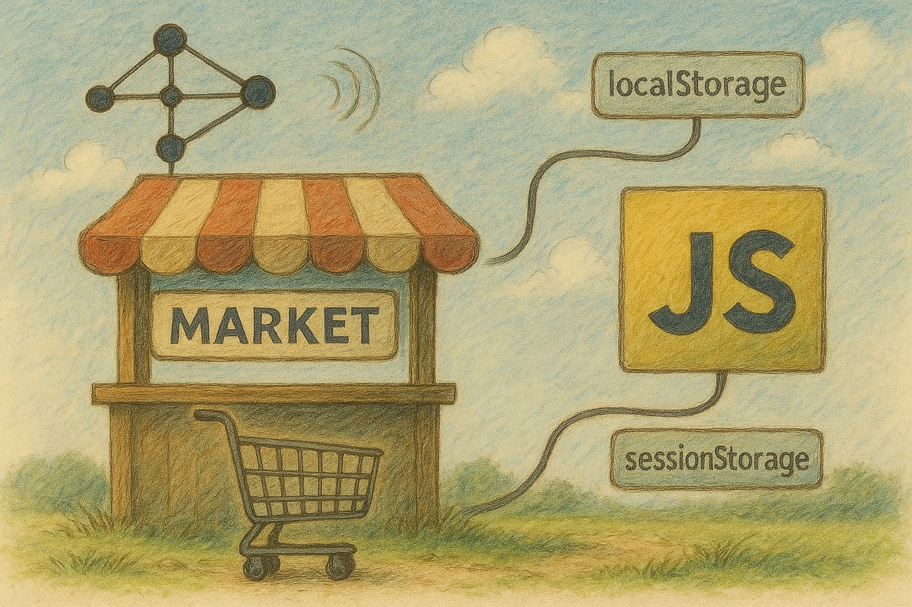

# market.js

[](https://www.npmjs.com/package/@nethaven/market)
[](https://github.com/NethavenCompany/market.js/blob/main/LICENSE)

A lightweight, zero-dependency storage wrapper with a simple API for managing browser storage (localStorage and sessionStorage) with event handling capabilities.

## Features

- 🚀 Zero dependencies
- 📦 Simple and intuitive API
- 🔄 Event-driven architecture
- 🔌 Element subscription support
- 💾 Supports both localStorage and sessionStorage
- 🎯 TypeScript support
- 🌐 Browser-only package

## Requirements

- Modern browser with support for ES2017 or later
- Support for localStorage and sessionStorage APIs

## Table of Contents

- [market.js](#marketjs)
  - [Features](#features)
  - [Requirements](#requirements)
  - [Table of Contents](#table-of-contents)
  - [Installation](#installation)
  - [Quick Start](#quick-start)
  - [API Reference](#api-reference)
    - [Creating Markets](#creating-markets)
    - [Storage Operations](#storage-operations)
      - [`.get(product?: string)`](#getproduct-string)
      - [`.set(products: {})`](#setproducts-)
      - [`.has(product: string)`](#hasproduct-string)
      - [`.hasAll(products: {})`](#hasallproducts-)
      - [`.remove(...products: string[])`](#removeproducts-string)
      - [`.clear()`](#clear)
      - [`.destroy()`](#destroy)
    - [Event System](#event-system)
    - [Element Subscription](#element-subscription)
      - [Subscription Properties](#subscription-properties)
  - [Examples](#examples)
    - [Theme Switcher](#theme-switcher)
    - [Form Data Persistence](#form-data-persistence)
  - [Contributing](#contributing)
  - [Browser Support](#browser-support)
  - [Development](#development)
  - [License](#license)

## Installation

```bash
npm install @nethaven/market
# or
yarn add @nethaven/market
```

or get your own custom build at [plugins.nethaven.nl/market.js/build](https://plugins.nethaven.nl/market.js/build)

## Quick Start

```javascript
import { useLocalMarket } from '@nethaven/market';

// Create a new market for user settings
const settings = useLocalMarket("userSettings", { theme: "dark" });

// Set a value
settings.set({ theme: "light" });

// Get a value
const theme = settings.get("theme");

// Listen for changes
settings.on("set", (event, market) => {
  console.log("Theme updated:", event.newProducts.theme);
});
```

## API Reference

### Creating Markets

```javascript
import { useLocalMarket, useSessionMarket } from '@nethaven/market';

// Local storage market
const settings = useLocalMarket("userSettings", { theme: "dark" });

// Session storage market
const registration = useSessionMarket("registration");
```

---

### Storage Operations

#### `.get(product?: string)`
Retrieves a product or all products from the market.

```javascript
// Get specific product
const theme = settings.get("theme");

// Get all products
const allSettings = settings.get();
```

#### `.set(products: {})`
Sets one or more products in the market. Triggers `set` events.

```javascript
// Set single product
settings.set({ theme: "light" });

// Set multiple products
settings.set({ 
  theme: "light",
  font: "dyslexic",
  fontSize: "16px"
});
```

#### `.has(product: string)`
Checks if a product exists in the market.

```javascript
if (settings.has("theme")) {
  // Theme setting exists
}
```

#### `.hasAll(products: {})`
Checks if all specified products exist in the market.

```javascript
if (settings.hasAll({ theme: true, font: true })) {
  // All required settings exist
}
```

#### `.remove(...products: string[])`
Removes one or more products from the market. Triggers `remove` events.

```javascript
// Remove single product
settings.remove("theme");

// Remove multiple products
settings.remove("theme", "font");
```

#### `.clear()`
Clears all products from the market. Triggers `clear` events.

```javascript
settings.clear();
```

#### `.destroy()`
Destroys the market by clearing all event listeners and removing the data from storage. Triggers `destroy` events.

```javascript
settings.destroy();
```

---

### Event System

The market provides a comprehensive event system for monitoring storage operations. Each event includes relevant data about the operation.

```javascript
const settings = useLocalMarket("userSettings");

// Listen for specific events
settings.on("set", (event, market) => {
  const { products, oldProducts, newProducts } = event;

  console.log("Products before set:", event.oldProducts);
  console.log("New products:", event.newProducts);
  console.log("Current products:", event.products);
});

settings.on("remove", (event, market) => {
  const { products, oldProducts, removedProducts } = event;

  console.log("Products before remove:", oldProducts);
  console.log("Removed products:", removedProducts);
  console.log("Current products:", products);
});

settings.on("clear", (event, market) => {
  const { products, oldProducts } = event;

  console.log("Products before clear:", oldProducts);
  console.log("Current products:", products);
});

settings.on("destroy", (event, market) => {
  const { products } = event;

  console.log("Final state before destroying market:", products)
})

/* Available events:
* - set: Triggered when setting products
* - remove: Triggered when removing products
* - clear: Triggered when clearing the market
* - destroy: Triggered when destroying the market */
```

The `set` event has access to:
- `oldProducts`: The state of products before the update
- `newProducts`: The new products being set

The `remove` event has access to:
- `oldProducts`: The state of products before removal
- `removedProducts`: The products that were removed

The `clear` event has access to:
- `oldProducts`: The state of products before clearing

The `destroy` event has access to:
- `products`: The final state of products before destruction

> [!NOTE]
> 
> When using events with element subscriptions, you can either handle changes through the subscription callback or through one of the events like `set`. 
> There is one key difference between these methods that you should take note of when choosing one of these methods.
> 
> The callback method gives you access to both the `HTMLEvent` and the `MarketObject`, while the `set` event provides the `MarketEvent` and `MarketObject`.

---

### Element Subscription

Subscribe HTML elements to automatically update the market when their values change. The subscription system ensures that the element's value is always in sync with the market and vice versa.
This method is particularly useful for scenarios such as multi-page forms where you need to persist the state of form elements or for something like a theme selector.

```javascript
const settings = useLocalMarket("userSettings");

// Subscribe an element
const subscription = {
  element: document.querySelector("#themeSelector"),
  product: "theme",
  event: "change",
  attribute: "value",
  callback: (event, market) => {
    console.log("Theme updated:", event.target.value);
  }
};

settings.subscribeElement(subscription);

// Unsubscribe when done
settings.unsubscribeElement(subscription);
```

> [!NOTE]
> 
> The subscription system will automatically initialize the element's value with the current market value if it exists, or with the default value if specified. This ensures that the element and market stay in sync from the moment of subscription.

#### Subscription Properties
- `element`: The HTML element to subscribe to
- `product`: The market product to sync with
- `event`: The DOM event to listen for
- `attribute`: The element attribute to sync
- `callback`: Optional callback function called after the market is updated

## Examples

### Theme Switcher
```javascript
const settings = useLocalMarket("theme", { font: "Roboto", colors: "light" });

// Subscribe to theme toggle
settings.subscribeElement({
  element: document.querySelector("#themeToggle"),
  product: "colors",
  event: "change",
  attribute: "value",
  // You can either apply theme changes through the callback property whenever the HTMLEvent fires.
  callback: (event, market) => {
    document.body.className = event.target.value;
  }
});

// Or you can apply theme changes when the `set` event fires.
settings.on("set", (event, market) => {
  document.body.className = event.products.colors;
});
```

> [!NOTE]
> 
> When using events with element subscriptions, you can either handle changes through the subscription callback or through one of the events like `set`. 
> There is one key difference between these methods that you should take note of when choosing one of these methods.
> 
> The callback method gives you access to the `HTMLEvent`, while the `set` event provides the `MarketEvent`

### Form Data Persistence
```javascript
const registration = useSessionMarket("registration");

// Save form progress
registration.subscribeElement({
  element: document.querySelector("#registrationForm"),
  product: "data",
  event: "input",
  attribute: "value"
});

// Restore form on page load
window.addEventListener("load", () => {
  const savedData = registration.get("data");
  if (savedData) {
    // Restore form state
  }
});
```

## Contributing

Contributions are welcome! Please feel free to submit a Pull Request.

1. Fork the repository
2. Create your feature branch (`git checkout -b feature/amazing-feature`)
3. Commit your changes (`git commit -m 'Add some amazing feature'`)
4. Push to the branch (`git push origin feature/amazing-feature`)
5. Open a Pull Request

## Browser Support

This package is designed to work in all modern browsers that support:
- ES2017 or later
- localStorage and sessionStorage APIs
- DOM APIs

## Development

To contribute to the project:

1. Clone the repository
2. Install dependencies: `npm install`
3. Build the project: `npm run build`
4. Make your changes
5. Ensure the build passes: `npm run build`
6. Submit a pull request

## License

This project is licensed under the MIT License - see the [LICENSE](LICENSE) file for details.